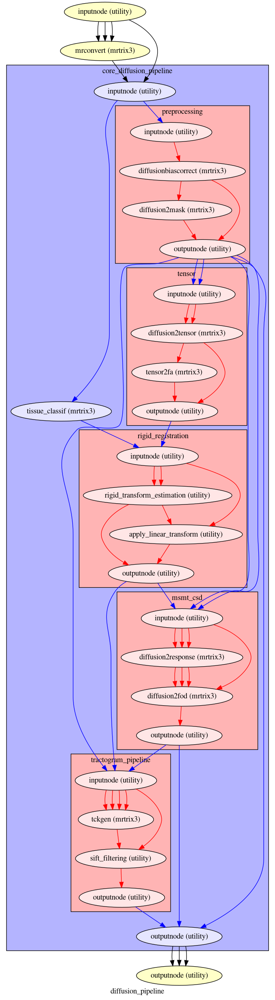

# Magnetic Resonance Imaging Processing
This package regroups pipelines used to process Magnetic Resonance Imaging (MRI) data. 

# Dependencies
The proposed treatment chains leverage the following  neuroimaging software:
+ [FSL](https://fsl.fmrib.ox.ac.uk/fsl/fslwiki) 
+ [Mrtrix3](https://www.mrtrix.org)
+ [Ants](https://github.com/ANTsX/ANTs)

 
# Installation
```bash
git clone https://github.com/alexpron/mrproc.git
```

## User 
```bash
pip install . 
```
## Developer
```bash
pip install -e .['dev']
```

# Current Diffusion pipeline 
